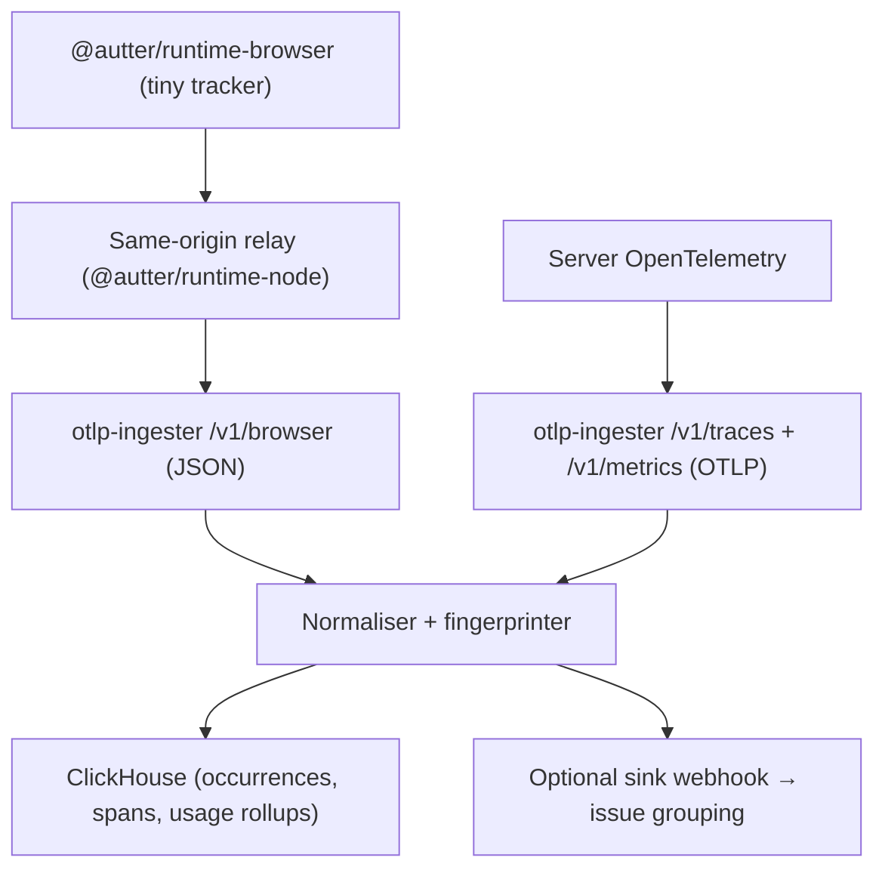

# Autter Runtime

Open-source, lightweight runtime telemetry for web apps — tiny error tracking
in the browser, standard OpenTelemetry on the server, one normalised signal
model, analysed per repository.

Autter Runtime deliberately does **not** ship the full OpenTelemetry browser
SDK to your users. The browser gets a dependency-free, <5 KB error tracker;
your server keeps real OTel; and this repo's **OTLP ingester** receives both
and writes them to ClickHouse in a compact, per-repo data model.



## Packages

| Package | Status | Description |
| --- | --- | --- |
| [`packages/otlp-ingester`](packages/otlp-ingester) | **v0.1** | Self-hostable ingest service: OTLP/HTTP (JSON) traces + metrics, browser error payloads → ClickHouse |
| [`packages/runtime-browser`](packages/runtime-browser) | **v0.1** | Zero-dependency browser error + usage tracker (~1 KB brotlied) |
| [`packages/runtime-node`](packages/runtime-node) | **v0.1** | Same-origin relay handler + curated OTel server tracker |
| [`packages/runtime-next`](packages/runtime-next) | **v0.1** | One-command Next.js integration (relay route + error boundary) |

Runnable demo: [`examples/express-app`](examples/express-app) — browser
tracker → relay → ingester and OTel server tracker, against a compose-run
ClickHouse.

## Supported stacks

| Stack | How | Key type |
| --- | --- | --- |
| React / any SPA / static site | `@autter/runtime-browser` (direct) | client key (publishable) |
| React/SPA with a backend | `@autter/runtime-browser` → relay | none in browser; server key in relay |
| Next.js | `@autter/runtime-next` | server key |
| Node (Express, Fastify, Koa, Nest) | `@autter/runtime-node` | server key |
| Go, Rust, Python, Java, .NET, … | any OTel SDK → OTLP/HTTP (protobuf **or** JSON) | server key |

Per-stack setup snippets: [`docs/INTEGRATIONS.md`](docs/INTEGRATIONS.md).

See [`docs/PLAN.md`](docs/PLAN.md) for the detailed roadmap and
[`docs/ARCHITECTURE.md`](docs/ARCHITECTURE.md) for the data model.

## Quick start (ingester)

```bash
docker compose up          # local ClickHouse + ingester
# or
cd packages/otlp-ingester
AUTTER_INGEST_KEYS='[{"key":"dev-key","orgId":"org1","repositoryId":"repo1"}]' \
CLICKHOUSE_URL=http://localhost:8123 \
npm run dev
```

Point your OpenTelemetry exporter at it:

```ts
new OTLPTraceExporter({
  url: "http://localhost:4318/v1/traces",
  headers: { authorization: "Bearer dev-key" },
});
```

## Design principles

- **Errors are 100%, everything else is sampled or aggregated.** Raw error
  occurrences are always kept (14-day TTL); successful traces are expected to
  be sampled upstream (0.5–1%); usage is stored as 1-minute rollups (90 days).
- **Per-repo analysis.** Every row is keyed by `org_id` + `repository_id`.
- **Privacy by construction.** No cookies, no DOM, no request/response bodies,
  no emails, no full URLs with query strings.
- **OTLP-compatible at the ingestion layer**, not inside a 3 KB browser script.

## License

MIT
