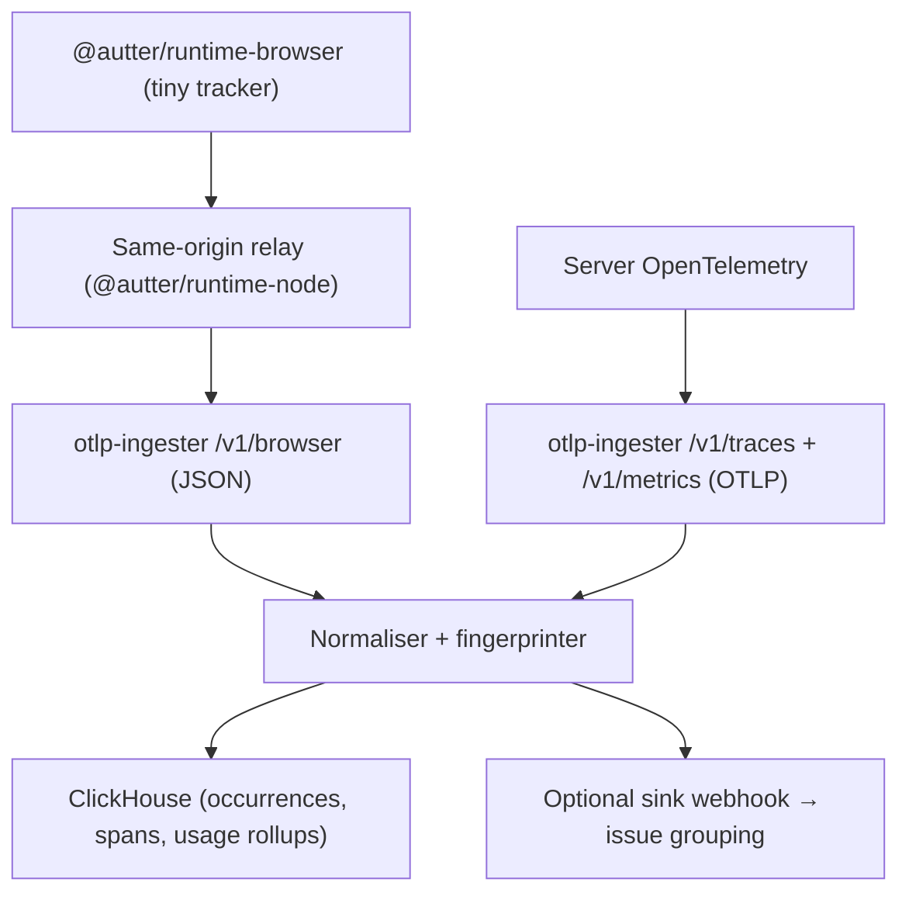

# Autter Runtime

Open-source, lightweight runtime telemetry for web apps — tiny error tracking
in the browser, standard OpenTelemetry on the server, one normalised signal
model, analysed per repository.

Autter Runtime deliberately does **not** ship the full OpenTelemetry browser
SDK to your users. The browser gets a dependency-free, <5 KB error tracker;
your server keeps real OTel; and this repo's **OTLP ingester** receives both
and writes them to ClickHouse in a compact, per-repo data model.



## Install

```bash
npm install @autter/runtime-browser   # frontend (React, Vue, any SPA, static sites)
npm install @autter/runtime-node      # backend (Express, Fastify, Koa, Nest, plain Node)
npm install @autter/runtime-next      # Next.js (both halves in one package)
```

Prefer to have an AI agent set it up for you? Install the companion agent
skills — they inventory your repo and wire up Autter Runtime for whatever
language/framework each service uses, npm packages or not:

```bash
npx skills add Autter-dev/autter-skills --all
```

See [Autter-dev/autter-skills](https://github.com/Autter-dev/autter-skills).

**Frontend** — errors + usage, automatic from init:

```ts
import { initAutterBrowser, captureException, trackEvent } from "@autter/runtime-browser";

initAutterBrowser({
  endpoint: "/api/autter-runtime",   // your relay route (recommended), or
  // endpoint: "https://otlp.autter.dev/v1/browser", clientKey: "autter_rtc_…",
  service: "web-app",
  release: import.meta.env.VITE_GIT_SHA,
});

captureException(err, { operation: "start-checkout" });
trackEvent("clicked_upgrade");
```

**Backend** — one preloaded file, requests traced automatically:

```js
// instrument.cjs — run with: node --require ./instrument.cjs server.js
const { initAutterServer } = require("@autter/runtime-node");
initAutterServer({
  apiKey: process.env.AUTTER_RUNTIME_KEY,   // secret server key
  service: "payments-api",
  release: process.env.GIT_SHA,
});
```

Full walkthrough (keys, relay setup, Next.js, verification):
**[docs/GETTING-STARTED.md](docs/GETTING-STARTED.md)**.

## Packages

| Package | Status | Description |
| --- | --- | --- |
| [`@autter/runtime-browser`](packages/runtime-browser) | **v0.1** | Zero-dependency browser error + usage tracker (~1 KB brotlied) |
| [`@autter/runtime-node`](packages/runtime-node) | **v0.1** | Same-origin relay handler + curated OTel server tracker |
| [`@autter/runtime-next`](packages/runtime-next) | **v0.1** | One-command Next.js integration (relay route + error boundary) |
| [`@autter/otlp-ingester`](packages/otlp-ingester) | **v0.1** | Self-hostable ingest service: OTLP/HTTP (protobuf + JSON) traces + metrics, browser payloads → ClickHouse |

Runnable demo: [`examples/express-app`](examples/express-app) — browser
tracker → relay → ingester and OTel server tracker, against a compose-run
ClickHouse.

## Supported stacks

| Stack | How | Key type |
| --- | --- | --- |
| React / any SPA / static site | `@autter/runtime-browser` (direct) | client key (publishable) |
| React/SPA with a backend | `@autter/runtime-browser` → relay | none in browser; server key in relay |
| Next.js | `@autter/runtime-next` | server key |
| Node (Express, Fastify, Koa, Nest) | `@autter/runtime-node` | server key |
| Go, Rust, Python, Java, .NET, … | any OTel SDK → OTLP/HTTP (protobuf **or** JSON) | server key |

Per-stack setup snippets: [`docs/INTEGRATIONS.md`](docs/INTEGRATIONS.md).

## Keys: frontend vs backend

Two credential types keep the frontend and backend cleanly separated:

| | Server key (`autter_rt_…`) | Client key (`autter_rtc_…`) |
| --- | --- | --- |
| Secrecy | **secret** — backend env vars only | **publishable** — safe in frontend bundles |
| Can send | OTLP traces/metrics + browser events | browser events only |
| Protection | rate limits | origin allow-list + tighter rate limits, write-only |

When your app has a backend, prefer the **relay**: the browser posts to your
own server, which forwards with the server key — no key in the browser at
all, and ad-blockers can't tell it apart from your own API traffic.

## Docs

- **[Getting started](docs/GETTING-STARTED.md)** — zero to data flowing
- [Stack integrations](docs/INTEGRATIONS.md) — React, Node, Next.js, Go, Rust, generic OTel
- [Architecture & data model](docs/ARCHITECTURE.md)
- [Roadmap](docs/PLAN.md) · [Releasing](docs/RELEASING.md)

## Hosting the ingester

**Autter cloud** hosts it at `otlp.autter.dev` (the SDKs' default
endpoint). Deployment runbook + scripts for the AWS/ECS setup:
[`deploy/aws`](deploy/aws).

**Self-hosting** — prebuilt multi-arch image, no clone needed:

```bash
docker run -p 4318:4318 \
  -e CLICKHOUSE_URL=… -e CLICKHOUSE_PASSWORD=… \
  -e AUTTER_INGEST_KEYS='[{"key":"…","orgId":"o","repositoryId":"r"}]' \
  ghcr.io/autter-dev/otlp-ingester:latest
```

Or for local development with a bundled ClickHouse:

```bash
docker compose up          # local ClickHouse + ingester on :4318, key "dev-key"
```

Point your OpenTelemetry exporter at it:

```ts
new OTLPTraceExporter({
  url: "http://localhost:4318/v1/traces",
  headers: { authorization: "Bearer dev-key" },
});
```

## Design principles

- **Errors are 100%, everything else is sampled or aggregated.** Raw error
  occurrences are always kept (14-day TTL); successful traces are expected to
  be sampled upstream (0.5–1%); usage is stored as 1-minute rollups (90 days).
- **Per-repo analysis.** Every row is keyed by `org_id` + `repository_id`.
- **Privacy by construction.** No cookies, no DOM, no request/response bodies,
  no emails, no full URLs with query strings.
- **OTLP-compatible at the ingestion layer**, not inside a 3 KB browser script.

## License

MIT
