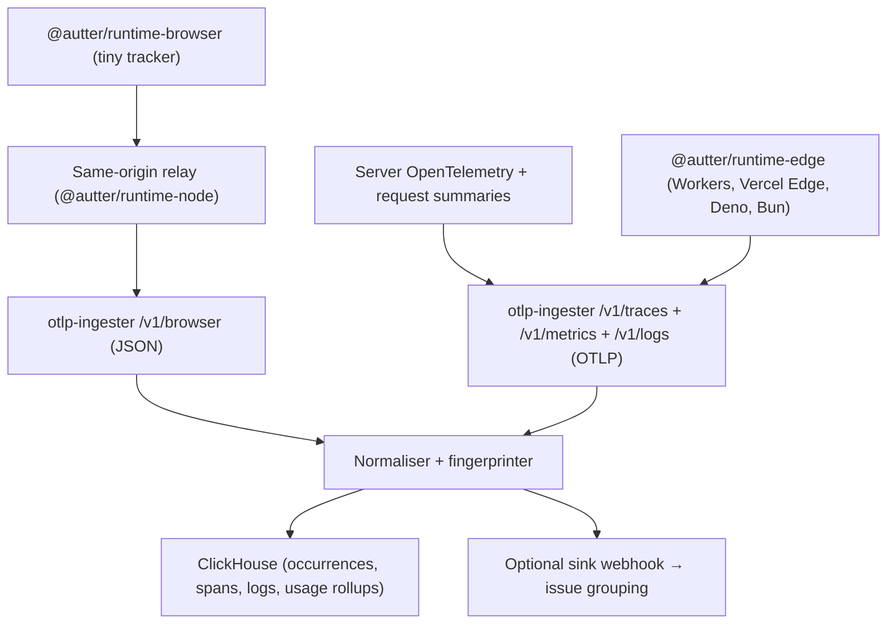

# Autter Runtime

Open-source, lightweight runtime telemetry for web apps — tiny error tracking
in the browser, standard OpenTelemetry on the server, one normalised signal
model, analysed per repository.

Autter Runtime deliberately does **not** ship the full OpenTelemetry browser
SDK to your users. The browser gets a dependency-free, <5 KB error tracker;
your server keeps real OTel; and this repo's **OTLP ingester** receives both
and writes them to ClickHouse in a compact, per-repo data model.


```mermaid
flowchart TD
    A["@autter/runtime-browser (tiny tracker)"] --> B["Same-origin relay (@autter/runtime-node)"]
    B --> D["otlp-ingester /v1/browser (JSON)"]
    C["Server OpenTelemetry + request summaries"] --> E["otlp-ingester /v1/traces + /v1/metrics + /v1/logs (OTLP)"]
    I["@autter/runtime-edge (Workers, Vercel Edge, Deno, Bun)"] --> E
    D --> F["Normaliser + fingerprinter"]
    E --> F
    F --> G["ClickHouse (occurrences, spans, logs, usage rollups)"]
    F --> H["Optional sink webhook → issue grouping"]
```

## Existing external logs

Connect Sentry, PostHog, Grafana/Loki, Datadog or webhooks in the Autter platform's repository Runtime settings. Independent platform workers store provider records and run eligible RCA/draft fixes. This path does not require installing these SDKs or changing the OTLP ingester. See [External sources](docs/EXTERNAL-SOURCES.md) for setup and the distinction from SDK telemetry.

## Install

```bash
npm install @autter/runtime-browser   # frontend (React, Vue, any SPA, static sites)
npm install @autter/runtime-node      # backend (Express, Fastify, Koa, Nest, plain Node)
npm install @autter/runtime-next      # Next.js (both halves in one package)
npm install @autter/runtime-edge      # Cloudflare Workers, Vercel Edge, Deno, Bun (zero deps)
```

| Package | Version | Use it for |
| --- | --- | --- |
| `@autter/runtime-browser` | 1.4.0 | Browser errors + usage, coded-error duck typing, request-id capture |
| `@autter/runtime-node` | 1.5.0 | Node servers: OTel tracing, request summaries, coded errors, operations |
| `@autter/runtime-next` | 1.5.0 | Next.js: server + client + `/edge` for `middleware.ts` |
| `@autter/runtime-edge` | 1.0.0 | Fetch-only runtimes: request summaries and coded errors over `/v1/logs` |
| `@autter/otlp-ingester` | 1.5.0 | Self-hosted ingest — upgrade it **before** the SDKs |

Prefer to have an AI agent set it up for you? Install the companion agent
skills — they inventory your repo and wire up Autter Runtime for whatever
language/framework each service uses, npm packages or not:

```bash
npx skills add Autter-dev/autter-skills --all
```

See [Autter-dev/autter-skills](https://github.com/Autter-dev/autter-skills).

Server memory pressure detection works through the same OTLP/HTTP metric
endpoint for **any language**. The Node package exports process metrics for
you; Python, Go, Rust, JVM, .NET, and other services use their OTel meter
provider or a process collector to emit the [portable memory metrics](docs/MEMORY-PRESSURE.md).
An OOM kill must be forwarded by ECS or Kubernetes because the killed process
cannot report it afterward.

**Frontend** — errors + usage, automatic from init:

```ts
import { initAutterBrowser, captureException, trackEvent } from "@autter/runtime-browser";

initAutterBrowser({
  endpoint: "/api/autter-runtime",   // your relay route (recommended), or
  // endpoint: "https://otlp.autter.dev/v1/browser", clientKey: "autter_rtc_…",
  service: "web-app",
  release: import.meta.env.VITE_GIT_SHA,
});

captureException(err, { operation: "start-checkout" });
trackEvent("clicked_upgrade");
```

**Backend** — one preloaded file, created in your own app next to its entry
point, requests traced automatically:

```js
// instrument.cjs — run with: node --require ./instrument.cjs server.js
const { initAutterServer } = require("@autter/runtime-node");
initAutterServer({
  apiKey: process.env.AUTTER_RUNTIME_KEY,   // secret server key
  service: "payments-api",
  release: process.env.GIT_SHA,
});
```

**Requests and coded errors** (1.5.0) — one summary per request, always
kept, with a request id echoed to the client; one issue per error code:

```js
const { autterRequests, autterErrorResponse, defineRuntimeErrors, runtimeContext } =
  require("@autter/runtime-node");

const billing = defineRuntimeErrors("billing", {
  declined: { status: 402, message: "Payment declined", expected: true, fix: "Try another card" },
});
app.use(autterRequests({ ignore: ["/healthz"] }));
app.post("/checkout", (req, res, next) => {
  runtimeContext.set({ cart: { items: 3 } });
  next(billing.declined());            // → 402 { error: { message, code, fix, requestId } }
});
app.use(autterErrorResponse());
```

See [Requests, coded errors and background work](docs/REQUESTS-AND-ERRORS.md).

**LLM calls** — initialised with the server tracker, recorded at 100%
(model, tokens, latency, USD cost). One line per client:

```js
const { instrumentLlmClient } = require("@autter/runtime-node");

const openai = instrumentLlmClient(new OpenAI());   // that's it — every
// chat/embedding/stream call through this client is traced automatically
```

Vercel AI SDK users don't even need that — set
`experimental_telemetry: { isEnabled: true }` on the call. For raw-fetch
clients there's a manual `withLlmCall` wrapper (see
[`@autter/runtime-node`](packages/runtime-node)).

Full walkthrough (keys, relay setup, Next.js, verification):
**[docs/GETTING-STARTED.md](docs/GETTING-STARTED.md)**.

## Packages

| Package | Status | Description |
| --- | --- | --- |
| [`@autter/runtime-browser`](packages/runtime-browser) | **v1.4** | Zero-dependency browser error + usage tracker (<5 KB gzipped) |
| [`@autter/runtime-node`](packages/runtime-node) | **v1.5** | Curated OTel server tracker, request summaries, coded errors, operation logging, same-origin relay |
| [`@autter/runtime-next`](packages/runtime-next) | **v1.5** | One-command Next.js integration (server, client, relay route, error boundary, edge middleware) |
| [`@autter/runtime-edge`](packages/runtime-edge) | **v1.0** | Zero-dependency edge SDK: request summaries and coded errors for Workers, Vercel Edge, Deno, Bun |
| [`@autter/otlp-ingester`](packages/otlp-ingester) | **v1.5** | Self-hostable ingest service: OTLP/HTTP (protobuf + JSON) traces, metrics, logs, browser payloads → ClickHouse |

`packages/runtime-core` is private: shared code bundled into runtime-node and
runtime-edge at build time, never published.

Runnable demo: [`examples/express-app`](examples/express-app) — browser
tracker → relay → ingester, OTel server tracker, request summaries and coded
errors, against a compose-run ClickHouse. Edge:
[`examples/edge-worker`](examples/edge-worker) (Cloudflare Worker).

## Supported stacks

For endpoint latency detection and slow-request retention, see [endpoint regression telemetry](docs/ENDPOINT-REGRESSIONS.md).

| Stack | How | Key type |
| --- | --- | --- |
| React / any SPA / static site | `@autter/runtime-browser` (direct) | client key (publishable) |
| React/SPA with a backend | `@autter/runtime-browser` → relay | none in browser; server key in relay |
| Next.js | `@autter/runtime-next` | server key |
| Node (Express, Fastify, Koa, Nest) | `@autter/runtime-node` | server key |
| Cloudflare Workers, Vercel Edge, Deno, Bun | `@autter/runtime-edge` | server key (secret binding) |
| Go, Rust, Python, Java, .NET, … | any OTel SDK → OTLP/HTTP (protobuf **or** JSON) | server key |

Per-stack setup snippets: [`docs/INTEGRATIONS.md`](docs/INTEGRATIONS.md).

## Keys: frontend vs backend

Two credential types keep the frontend and backend cleanly separated:

| | Server key (`autter_rt_…`) | Client key (`autter_rtc_…`) |
| --- | --- | --- |
| Secrecy | **secret** — backend env vars only | **publishable** — safe in frontend bundles |
| Can send | OTLP traces/metrics/logs + browser events | browser events only |
| Protection | rate limits | origin allow-list + tighter rate limits, write-only |

When your app has a backend, prefer the **relay**: the browser posts to your
own server, which forwards with the server key — no key in the browser at
all, and ad-blockers can't tell it apart from your own API traffic.

## Docs

- **[Getting started](docs/GETTING-STARTED.md)** — zero to data flowing
- [Stack integrations](docs/INTEGRATIONS.md) — React, Node, Next.js, Go, Rust, generic OTel
- [Using Autter Runtime **without npm**](docs/WITHOUT-NPM.md) — any OTel SDK, an OTel Collector, or plain HTTP from any language
- [Architecture & data model](docs/ARCHITECTURE.md)
- [Operation logging and diagnostic context](docs/OPERATION-LOGGING.md)
- [Requests, coded errors and background work](docs/REQUESTS-AND-ERRORS.md)
- [Continuous detection, profiles, and outcomes](docs/CONTINUOUS-DETECTION.md)
- [Roadmap](docs/PLAN.md) · [Releasing](docs/RELEASING.md)

## Contributing

Contributions of every size are welcome — bug reports, docs fixes, new
language integrations, features. We'd be more than glad to have you: see
[CONTRIBUTING.md](CONTRIBUTING.md) for the dev setup, ground rules, and
good first areas to pick up.

## Hosting the ingester

**Autter cloud** hosts it at `otlp.autter.dev` (the SDKs' default
endpoint). Deployment runbook + scripts for the AWS/ECS setup:
[`deploy/aws`](deploy/aws).

**Self-hosting on your own server** — one small EC2/Lightsail box running
the ingester + ClickHouse together via Docker Compose, with Caddy handling
HTTPS automatically. No VPC/ECS setup required:
[`deploy/single-server`](deploy/single-server).

**Self-hosting, bring-your-own-infra** — prebuilt multi-arch image, no clone
needed:

```bash
docker run -p 4318:4318 \
  -e CLICKHOUSE_URL=… -e CLICKHOUSE_PASSWORD=… \
  -e AUTTER_INGEST_KEYS='[{"key":"…","orgId":"o","repositoryId":"r"}]' \
  ghcr.io/autter-dev/otlp-ingester:latest
```

Or for local development with a bundled ClickHouse:

```bash
docker compose up          # local ClickHouse + ingester on :4318, key "dev-key"
```

Point your OpenTelemetry exporter at it:

```ts
new OTLPTraceExporter({
  url: "http://localhost:4318/v1/traces",
  headers: { authorization: "Bearer dev-key" },
});
```

## Design principles

- **Errors are 100%, everything else is sampled or aggregated.** Raw error
  occurrences are always kept (14-day TTL); traces containing an error are
  retained in full (the Node SDK tail-retains them), so every issue keeps the
  trace that explains it; healthy traces are expected to be sampled upstream
  (0.5–1%); usage is stored as 1-minute rollups (90 days). Request and
  operation summaries are one bounded record per unit of work and are always
  kept (`LOG_TTL_DAYS`, default 14).
- **Per-repo analysis.** Every row is keyed by `org_id` + `repository_id`.
- **Privacy by construction.** No cookies, no DOM, no request/response bodies,
  no emails, no full URLs with query strings.
- **OTLP-compatible at the ingestion layer**, not inside a 3 KB browser script.

## License

MIT

### Investigating your system

Use Dashboard Ask or `autter ask`, `autter logs`, and `autter threads` to investigate captured Runtime signals and resume saved debugging sessions. See [system investigations](docs/ASK.md).
